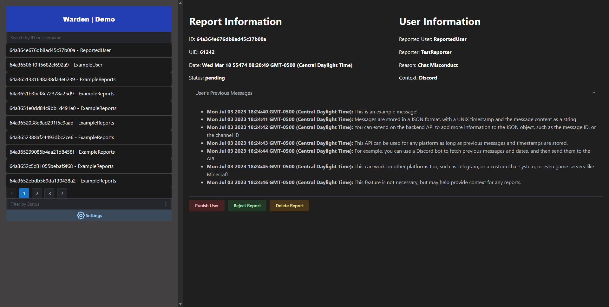

# Warden: Advanced Report Queue and Content Moderation System

Warden is a React application that serves as a cutting-edge report queue and content moderation system, designed to be extended upon for any use case.

## [Live Demo](https://michaelsimmonsio.github.io/warden-page/)
Some features, such as deleting reports, are disabled in the demo.

## Features

- Utilizes a Express Node.js API to seamlessly retrieve a comprehensive list of reports from a MongoDB database, ensuring efficient data management and retrieval.

- Uses Socket.io, a powerful websockets library, to establish real-time communication with the backend Node.js server. This opens up endless possibilities for extending Warden's functionality, such as integrating with other applications like Discord bots for user punishment or report creation.

- Authentication system that uses Firebase authentication to ensure that only authorized users can access the report queue. This can be easily expanded upon to include more features, such as user roles and permissions.

- Uses Pagination to display reports in a clean and organized manner, allowing users to easily navigate through a virtually unlimited report queue.

- Introduces a versatile modal system that enables users to issue punishments with custom timeframes. All durations are automatically converted to seconds, simplifying the process for users. The Punish modal has an example function written that communicates with the backend server's websocket and executes a function from the backend server. This can easily be expanded on to use this app for many use cases.

- The Node.js backend, which serves as the foundation for Warden's functionality, demonstrates a set of basic functions that highlight its extensibility and potential for customization.

- Search and Filter functionality that allows users to search for reports by username, report ID, or report reason. This can be easily expanded upon to include more search parameters. Users can filter by report status, allowing them to easily find reports that have not been reviewed or have been resolved.

- Notification system that displays a notification when a user issues a punishment. This can be easily expanded upon to include more notifications, such as when a user resolves a report.

- Uses Mantine, a UI framework, to create a clean and modern user interface.

- Uses Vite to make development easier.

## Images

 

## Why Use

This is a barebones project that can be extended on to use for content moderation or report queues for any use case. Its comprehensive feature set and seamless integration with MongoDB make it a powerful solution for managing report queues and enforcing content moderation. The extensibility of Warden's backend allows for easy integration with other applications, providing a solid foundation for building complex systems tailored to your specific requirements.

## Backend Repository

To explore the Node.js backend repository that underpins Warden's functionality and serves as a starting point for customization and expansion, please visit [this link](https://github.com/add/backend/link/later).

## Skills
This is a personal project that helped me learn the following skills:
- React Development / front-end development
- Express Node.JS API 
- Socket.io / Web Sockets
- MongoDB
- Cross-Origin Resource Sharing (CORS)
- UI Frameworks (Mantine)
- Vite
